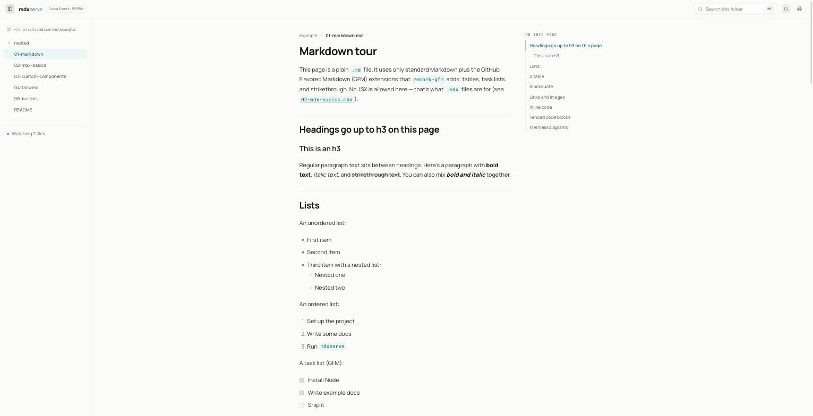
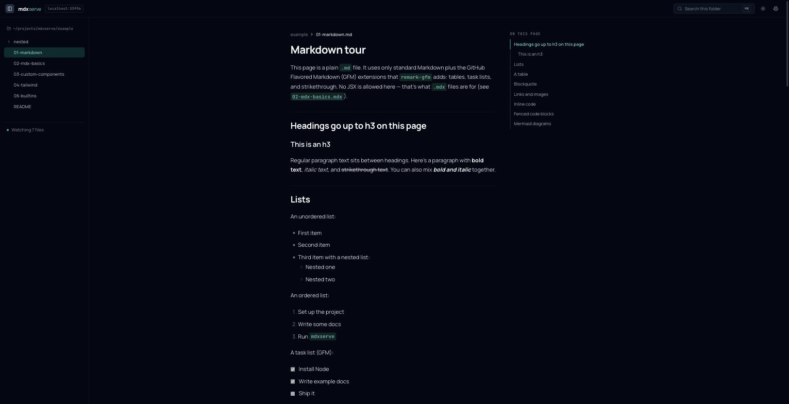
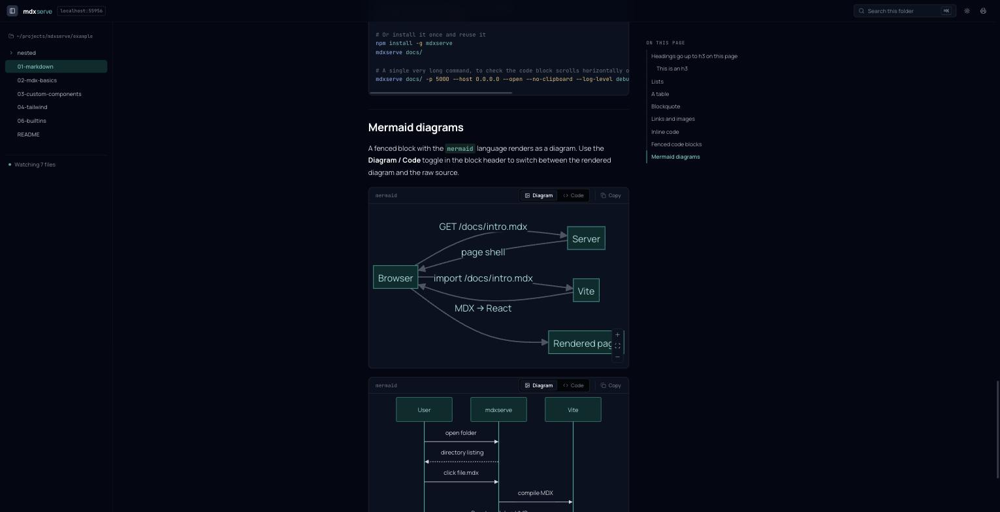
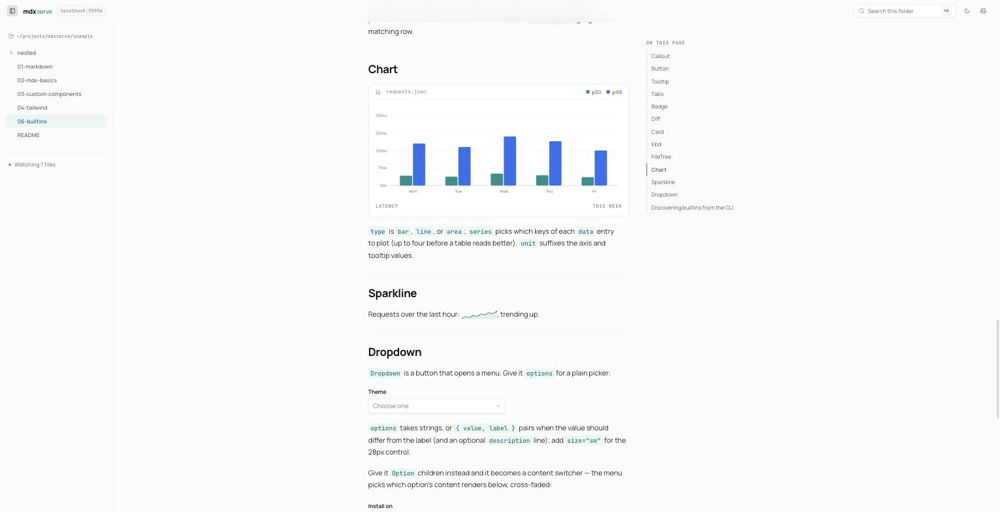

# mdxserve

`npx serve`, but for Markdown/MDX.

Point it at a directory and it serves a Notion-like listing of your `.md`/`.mdx`
files. Clicking a file renders it in the browser through Vite — so plain
Markdown just renders, and any JSX or components you `import` in an `.mdx`
file work too, with Tailwind available everywhere and Vite HMR while you edit.





## Install

From a fresh clone:

```bash
./setup.sh
```

This runs `yarn install`, `yarn build`, links `mdxserve` onto your `PATH` with
`npm link`, and registers the skills in `./skills` with Claude Code, Codex, and
`~/.agents/skills` via `npx skills add`. Re-run it after editing `./skills`.

## Usage

```bash
npx mdxserve [dir]           # serve `dir` (defaults to the current directory)
npx mdxserve -p 5000 [dir]   # pick a port (default 4040; falls back to a free port if taken)
npx mdxserve --host 0.0.0.0 [dir]  # expose on the LAN (default binds to 127.0.0.1 only)
npx mdxserve -D [dir]        # run in the background via oxmgr (prints the stop/delete commands)
npx mdxserve -w ~/notes -w ~/work/docs  # serve several unrelated folders at once
npx mdxserve docs -w ~/notes            # [dir] is shorthand for one more `-w` root
```

Then open the printed URL — with a single root it redirects straight to that
folder's listing; with more than one, `/` lists the mounted roots. URLs mirror
the absolute filesystem path (`~/notes/foo.md` is served at
`/Users/you/notes/foo.md`), and anything outside a mounted root 404s. Folders
always show a listing; `.md`/`.mdx` files render as pages. Everything else in
a directory is listed too, muted and unclickable, so you can see what's there.

## Writing docs

- `.md` and `.mdx` are treated identically: GitHub-flavored Markdown (tables, task lists, etc.)
  with syntax-highlighted code blocks.
- Any file can `import` React components (`.tsx`/`.jsx`) and use them
  directly as JSX. Components are resolved relative to the MDX file, exactly
  like any other Vite/ESM import — no magic auto-registration.
- Tailwind utility classes work anywhere in your MDX/JSX.

See [`example/`](./example) for a working tour of all of this — run it with:

```bash
yarn dev   # runs `mdxserve example`
```

## Reading

Every page sits in the same shell: a sidebar listing the current document's folder, the rendered
document in a 44rem column, and a table of contents that tracks the heading you are
reading. The topbar has search (`⌘K` / `Ctrl K`), a light/dark toggle that remembers
your choice, and print. Pages link to their previous and next neighbour and name the
source file and when it was last edited.

Mermaid fences render as pan-and-zoom diagrams themed to match, with a Diagram/Code
toggle; code blocks carry a language or filename label and a copy button.



## Navigation and motion

The whole site is one client-side app: clicking into a folder or a `.md`/`.mdx` file
navigates without a full page reload, with a subtle enter/exit fade between views
(listing rows stagger in, docs cross-fade, the browser back/forward buttons work as
expected). In-page links scroll smoothly. Everything respects `prefers-reduced-motion` —
turn it on and the transforms drop out while views still swap.

Links to anything else (images, `.txt` files, other sites) are left alone and behave
like normal `<a href>` navigation.

## Builtin components



`mdxserve` ships a small library of components that are available in every `.mdx` file with
no `import` needed:

- `Callout` — a boxed aside with an icon, for notes, tips, and warnings
- `Button` — a link/button with variants, sizes, and a small tap animation
- `Tooltip` — a hover/focus tooltip (via tippy.js) for inline content
- `Tabs` / `Tab` — a tabbed container that cross-fades between panels
- `Badge` — a small inline pill for a status, tag, or label
- `Diff` — a before/after code diff with unified or side-by-side views
- `Card` / `CardGrid` — a bordered content card, with a responsive grid to lay several out
- `Kbd` — a small styled key cap for keyboard shortcuts
- `FileTree` — a collapsible file/folder tree
- `Chart` — a bar/line/area chart rendered as inline SVG
- `Sparkline` — a tiny inline trend line

```mdx
<Callout tone="warn" title="Heads up">
	Some caveat worth calling out.
</Callout>

<Tabs>
	<Tab label="npm">Run `npm install`.</Tab>
	<Tab label="yarn">Run `yarn install`.</Tab>
</Tabs>
```

A local `import` of a component with the same name always takes priority over a builtin.
Each builtin's props are defined with a `zod` schema, which doubles as a JSON Schema registry
you can query from the CLI (useful for humans and for AI agents writing docs):

```bash
mdxserve components search            # list every builtin component
mdxserve components search callout    # search by name, description, or prop
mdxserve components show Callout      # full details, including a props table
mdxserve components show Callout --json
```

The registry is generated by `yarn build`; see `example/06-builtins.mdx` for a live demo.

## MCP server

The easiest way to reach mdxserve's tools is the stdio bridge: `mdxserve mcp`. It doesn't
serve anything itself — instead it discovers every currently-running `mdxserve serve` and
answers tool calls across all of them. `./setup.sh` registers it automatically (as `mdxserve`,
with `claude mcp add -s user` and/or `codex mcp add`, whichever CLIs are present); pass
`--no-mcp` to skip that. For any other client, point it at the repo's `mcp.json`
(`{ "mcpServers": { "mdxserve": { "command": "mdxserve", "args": ["mcp"] } } }`).

Discovery works because every `mdxserve serve` registers itself (port, pid, roots) in
`~/.mdxserve/servers.db` on startup and unregisters on a clean shutdown; a stale row from a
crash is pruned automatically by checking its pid. `list_docs` and `search_docs` search across
the roots of every live server; `validate_doc` does too, but also accepts an absolute path
straight through with no server running at all — handy for validating a doc before a server is
even started.

| Tool              | Input                  | What it does                                                                                                           |
| ----------------- | ---------------------- | ---------------------------------------------------------------------------------------------------------------------- |
| `validate_doc`    | `{ path }`             | Compiles a `.md`/`.mdx` file and reports MDX compile errors, unknown components, unknown props, and render-time errors |
| `list_components` | `{ query? }`           | Same as `mdxserve components search`                                                                                   |
| `show_component`  | `{ name }`             | Same as `mdxserve components show`                                                                                     |
| `search_docs`     | `{ query }`            | The `⌘K` search                                                                                                        |
| `list_docs`       | `{ path?, maxDepth? }` | The doc tree of every served root, or of one directory                                                                 |

Paths are absolute, in the same form as the site's URLs (`/Users/you/notes/foo.md`);
`validate_doc` also takes a root-relative path when exactly one served root contains it.

`validate_doc`'s result also carries a `rendered` flag alongside `ok`: whenever a live
`mdxserve serve` owns the path (in HTTP mode, or proxied from the stdio bridge over
`POST /__mdxserve/api/validate`), the tool actually renders the doc server-side and reports any
throw as a `render-error` diagnostic — this is what catches a component that compiles fine but
blanks the page at render time. `rendered: false` means no live server was available, so only
the static checks ran. Even when `rendered: true`, errors thrown inside a
`useEffect`/`useLayoutEffect` and hydration mismatches are never caught — those stay
browser-only.

### HTTP, per instance

`mdxserve serve` also mounts the same MCP server (Streamable HTTP, stateless, read-only
tools) directly at `http://127.0.0.1:<port>/__mdxserve/mcp` — useful when you want to talk to
one specific instance rather than every running server:

```bash
claude mcp add --transport http mdxserve http://127.0.0.1:4040/__mdxserve/mcp
```

The port must match `-p` — the startup banner prints the exact URL to use. With
`--host 0.0.0.0`, anyone on the LAN can call these tools too, same as the existing delete
API; unlike that one, the MCP tools are read-only.

## Agent skill

`skills/mdxserve/SKILL.md` teaches an AI agent how to write Markdown that renders well here
while staying portable, and how to discover the builtin components with
`mdxserve components search`. It prefers the MCP tools (`list_components`, `show_component`,
`validate_doc`) when the mdxserve MCP server is connected, and falls back to the CLI
otherwise. `./setup.sh` installs the skill (via `npx skills add`) for Claude Code, Codex,
and `~/.agents/skills`; re-run it after editing anything under `skills/`.

## Cache

Vite pre-bundles the browser dependencies (React, mermaid, framer-motion, …)
on first start and keeps that cache in a hidden `.mdxserve/` folder under the
first root you pass (the first `-w`, or `[dir]` if you didn't pass `-w`), so
later starts are fast and nothing is written outside your docs folders. It is
safe to delete at any time, and worth adding to that folder's `.gitignore`.

```bash
npx mdxserve cache clean          # remove ./.mdxserve
npx mdxserve cache clean docs/    # remove docs/.mdxserve
```

## Development

Fresh clone: `./setup.sh` installs dependencies, builds, installs a `mdxserve` launcher in `~/.local/bin` (or `/usr/local/bin`),
and installs the agent skill. Day to day:

```bash
yarn typecheck
yarn build   # generates dist/registry.json, then bundles src/index.ts -> dist/cli.js
```
