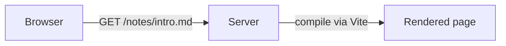

# mdxserve

`serve`, but for Markdown and MDX.

Point it at a folder of `.md` / `.mdx` files and it serves them as a site you can browse: a
listing of every folder, each file rendered as a page with syntax-highlighted code, mermaid
diagrams, and a set of builtin components, in light and dark. Save a file and the open page
updates. Write JSX in an `.mdx` file and it renders too.


It is built for folders of Markdown that already exist — notes, a `docs/` directory, plan
files an AI agent wrote — rather than for publishing a site. There is no build step and no
config file: run it, open the URL, read.

## Install

You need Node 20 or newer (CI runs 22) and `git`. mdxserve is not on npm yet, so install it from a clone:

```bash
git clone git@github.com:karimsa/mdxserve.git
cd mdxserve
./setup.sh
```

`setup.sh` installs dependencies, builds, and links an `mdxserve` command onto your `PATH`
(`~/.local/bin`, or `/usr/local/bin`). It also installs the writing skill for Claude Code and
Codex if either is present. It is safe to re-run.

## Quick start

```bash
mdxserve serve -w ~/notes          # serve one folder
mdxserve serve -w ~/notes -w ~/work/docs   # or several unrelated folders at once
```

Open the URL it prints (`http://127.0.0.1:4040` by default). With one folder you land in its
listing; with several, the home page lists them.

One server runs per user, and you can change what it serves without restarting it:

```bash
mdxserve roots add ~/work/docs     # start serving another folder
mdxserve roots remove ~/notes      # stop serving one
mdxserve roots list                # what is being served right now
mdxserve status                    # pid, port, URL, and the folders served
```

Folders you add this way last until the server stops. `mdxserve serve` with no `-w` starts
an empty server you can add folders to later.

| Flag          | Default     | Effect                                                    |
| ------------- | ----------- | --------------------------------------------------------- |
| `-w, --watch` | none        | Serve this folder; repeat the flag for more than one      |
| `-p, --port`  | `4040`      | Port to listen on; falls back to a free one if it's taken |
| `--host`      | `127.0.0.1` | Interface to bind; `0.0.0.0` exposes it on your LAN       |

## Writing docs

Any folder of Markdown works as-is. `.md` and `.mdx` are treated identically: both get
GitHub-flavored Markdown (tables, task lists, strikethrough), syntax-highlighted code blocks,
and mermaid diagrams. In an `.mdx` file you can also use JSX, `export` values, and `import`
your own React components.

Code fences take a title, a line-number gutter, and highlighted lines on the opening line:

````md
```ts title="src/server.ts" showLineNumbers {3-4}
const server = http.createServer(handler);
server.listen(port);
// these two lines are highlighted
console.log(`http://localhost:${port}`);
```
````

A ` ```mermaid ` fence renders as a pan-and-zoom diagram with a Diagram / Code toggle:

````md

````


### Builtin components

A small set of components is available in every file, `.md` included, with no import:

| Component           | For                                                      |
| ------------------- | -------------------------------------------------------- |
| `Callout`           | A note, tip, or warning the reader must not miss         |
| `Tabs` / `Tab`      | Per-OS or per-language variants of the same instructions |
| `Badge`             | A status or tag inline with text                         |
| `Tooltip`           | A short explanation on hover                             |
| `Button`            | A link styled as a call to action                        |
| `Diff`              | A before/after code change, unified or side by side      |
| `Card` / `CardGrid` | Linked cards laid out in a grid                          |
| `Kbd`               | A keyboard shortcut                                      |
| `FileTree`          | The shape of a directory                                 |
| `Chart`             | A bar (vertical or horizontal), line, area, or histogram |
| `Sparkline`         | A tiny inline trend line                                 |
| `Dropdown`          | A picker, or a switcher between longer panels of content |
| `Screenshot`        | An app or UI screenshot framed as a macOS window         |

```mdx
<Callout tone="warn" title="Before you deploy">
	Rotate the key first; the old one stops working immediately.
</Callout>

<Tabs>
	<Tab label="macOS">`brew install foo`</Tab>
	<Tab label="Linux">`apt install foo`</Tab>
</Tabs>

Status: <Badge tone="ok" dot>Online</Badge>
```


Every component's props are documented from the command line:

```bash
mdxserve components search           # list them all
mdxserve components show Callout     # props, defaults, and when to use it
```

### Your own components

An `.mdx` file can `import` a `.tsx` / `.jsx` component from next to it and use it as JSX.
Imports resolve relative to the file, like any other Vite import, and Tailwind utility classes
work anywhere. A local import with the same name as a builtin wins.

```mdx
import { Counter } from "./components/Counter";

<Counter start={3} />
```

### The example folder

[`example/`](./example) is a working tour of everything above — plain Markdown, MDX, custom
components, Tailwind, every builtin, and a page of charts. From a clone:

```bash
yarn dev    # serves ./example
```

## Reading and editing

Every page has the same shell: a sidebar listing the folder you are in, the document, and a
table of contents that follows you as you scroll. The sidebar and the content column are
resizable. Pages link to their previous and next neighbour and show which file they came from
and when it was last edited.

- `⌘K` / `Ctrl K` searches every served folder by title, heading, and body.
- The top bar toggles light and dark (it remembers your choice), prints, and exports.
- Double-click a section, or use its pencil, to edit it in place; `⌘S` saves,
  `Esc` cancels. The edit is written back to the file on disk.
- Saving a file from your editor re-renders the open page, and a toast names what changed.
- In a folder listing, select files to move them to the OS Trash (never deleted outright).
- Diagrams and charts open full-screen; a flowchart's direction can be flipped without
  touching the source.

Navigation is client-side — moving between folders and pages doesn't reload — and every
animation respects `prefers-reduced-motion`.

## Exporting a page

`mdxserve export` turns one document into a single HTML file that opens from `file://` on any
machine, with the same theme, code blocks, diagrams, and components as the live viewer:

```bash
mdxserve export docs/guide.md                     # writes ./guide.html
mdxserve export docs/guide.md -o ~/Desktop/guide.html
mdxserve export docs/guide.md --mermaid bundle    # fully offline; inlines mermaid (~2.4 MB)
```

The same export is in the viewer's top bar on any page. See
[`docs/advanced.md`](./docs/advanced.md#exporting) for exactly what the file does and doesn't
carry.

## Using it with AI agents

mdxserve is a good place to read what an agent writes — plan files, reports, design docs —
and it gives the agent tools to write for it well:

- **A writing skill.** `skills/mdxserve/SKILL.md` teaches an agent to write Markdown that
  renders richly here while staying plain and portable, and to check the builtin components
  before using them.
- **CLI verbs.** `mdxserve validate`, `search`, `docs`, `roots`, and `components` all take
  `--json`, so an agent can check a file, find docs, and manage served folders from a shell.

`validate` works without a server (compile errors, unknown components and props) but only
renders the doc when an `mdxserve serve` is running.
[`docs/advanced.md`](./docs/advanced.md#the-agent-cli) covers the verbs in detail.

## Keeping it running

`mdxserve serve` runs in the foreground. To keep it up after you close the terminal, use any
process manager — [oxmgr](https://github.com/Vladimir-Urik/OxMgr) is one option:

```bash
oxmgr start "mdxserve serve"
mdxserve roots add ~/notes

oxmgr logs mdxserve      # tail the server log
oxmgr stop mdxserve      # stop it
```

## Going further

| Read                                           | If you want to                                                                                                             |
| ---------------------------------------------- | -------------------------------------------------------------------------------------------------------------------------- |
| [`docs/advanced.md`](./docs/advanced.md)       | Understand the one-server-per-user model, URL and root rules, LAN exposure, the cache, exports in depth, and the agent CLI |
| [`docs/http-api.md`](./docs/http-api.md)       | Call the server's typed HTTP API directly                                                                                  |
| [`docs/development.md`](./docs/development.md) | Work on mdxserve itself: build, test, add a builtin, and where things live                                                 |
| [`AGENTS.md`](./AGENTS.md)                     | The architecture rules the codebase follows (also what coding agents read)                                                 |
