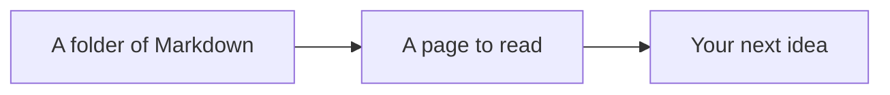

import Counter from "./examples/components/Counter";

# mdxserve

A folder of Markdown, ready to read in your browser.

mdxserve turns your notes, project plans, and docs into pages you can browse and search. Code gets highlighting, diagrams get room to breathe, and React components work alongside the prose. This site is a folder of MDX files running in the same reader.

<CardGrid>
	<Card
		title="Take the interactive tour"
		description="Try tabs, charts, diagrams, and code diffs in a working document."
		href="./tour.mdx"
	/>
	<Card
		title="Open your own folder"
		description="Run one command and start reading the Markdown you already have."
		href="./get-started.mdx"
	/>
</CardGrid>

## Try a little MDX

A document can explain something and let you try it. Switch between these examples, inspect a diagram, or click the counter.

<Tabs>
  <Tab label="A diagram">



Use the diagram's controls to zoom, expand it, or read its Mermaid source. The whole drawing comes from a code fence in this file.

  </Tab>
  <Tab label="A chart">

<Chart
	filename="sample-notes.json"
	type="bar"
	data={[
		{ label: "Mon", notes: 4 },
		{ label: "Tue", notes: 7 },
		{ label: "Wed", notes: 5 },
		{ label: "Thu", notes: 9 },
		{ label: "Fri", notes: 6 },
	]}
	series={["notes"]}
	yLabel="Notes read"
/>

Hover over a bar to see its value. These are sample numbers, passed straight to the builtin `Chart` component.

  </Tab>
  <Tab label="A React component">

<Counter />

This counter is imported from a neighboring file. Its state lives in your browser and resets when the component remounts or you reload.

```mdx
import Counter from "./examples/components/Counter";

<Counter />
```

  </Tab>
</Tabs>

## Find an example worth borrowing

The [example collection](./examples/README.mdx) has nine documents to explore. Start with the part you want to use:

| What you're writing                              | Open an example                                                                                                                                 |
| ------------------------------------------------ | ----------------------------------------------------------------------------------------------------------------------------------------------- |
| Notes, guides, and READMEs                       | [Markdown formatting](./examples/01-markdown.mdx)                                                                                               |
| Instructions with tabs, callouts, and code diffs | [Builtin components](./examples/06-builtins.mdx)                                                                                                |
| Reports with charts or sortable tables           | [Charts](./examples/07-charts.mdx) and [data tables](./examples/12-data-tables.mdx)                                                             |
| An explanation that needs a diagram              | [Mermaid diagrams](./examples/08-diagram-authoring.mdx)                                                                                         |
| Something with its own layout or interaction     | [MDX basics](./examples/02-mdx-basics.mdx), [React components](./examples/03-custom-components.mdx), and [Tailwind](./examples/04-tailwind.mdx) |

The reader around this page is part of the demo, too. Try its theme switch, search the documents with `⌘K` or `Ctrl K`, or follow a heading in the table of contents.

## Bring your own files

With Node.js 22.12 or newer, point mdxserve at a folder:

```bash
npx @karimsa/mdxserve serve -w ./docs
```

Open the URL it prints. On your own machine, you can edit sections and save them back to disk, watch changes from your text editor appear, and export a page to a standalone HTML file.

[Get started with mdxserve](./get-started.mdx), or browse the [source on GitHub](https://github.com/karimsa/mdxserve). Open source under the MIT license.
