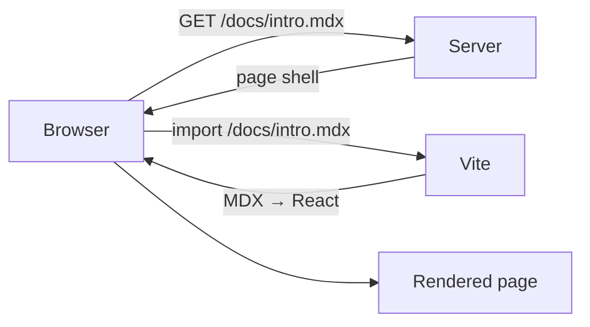
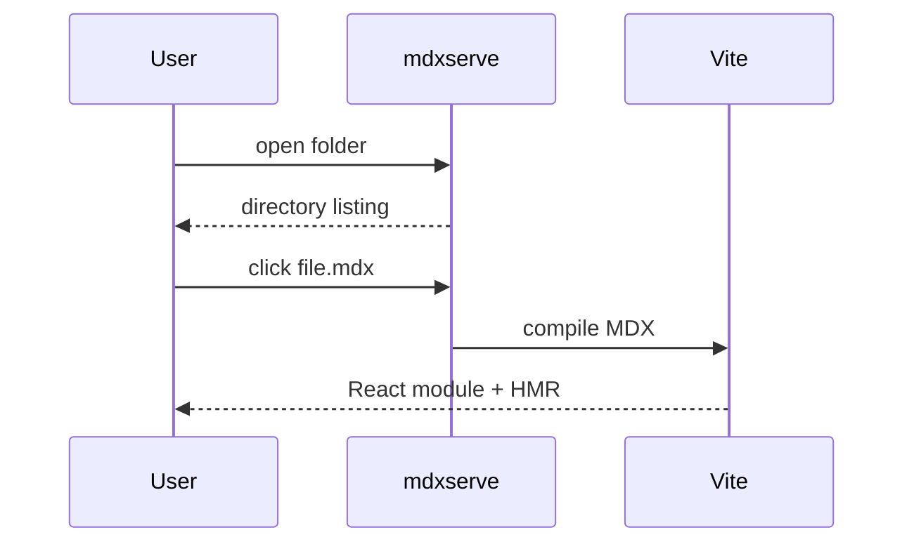

# Markdown tour

This page is a plain `.md` file. It uses only standard Markdown plus the GitHub Flavored
Markdown (GFM) extensions that `remark-gfm` adds: tables, task lists, and strikethrough. No
JSX is allowed here — that's what `.mdx` files are for (see [`02-mdx-basics.mdx`](./02-mdx-basics.mdx)).

## Headings go up to h3 on this page

### This is an h3

Regular paragraph text sits between headings. Here's a paragraph with **bold text**, _italic
text_, and ~~strikethrough text~~. You can also mix **_bold and italic_** together.

## Lists

An unordered list:

- First item
- Second item
- Third item with a nested list:
  - Nested one
  - Nested two

An ordered list:

1. Set up the project
2. Write some docs
3. Run `mdxserve`

A task list (GFM):

- [x] Install Node
- [x] Write example docs
- [ ] Ship it

## A table

| Feature             | Supported | Notes                            |
| ------------------- | --------- | -------------------------------- |
| Tables              | Yes       | via `remark-gfm`                 |
| Task lists          | Yes       | via `remark-gfm`                 |
| Syntax highlighting | Yes       | via Shiki / `rehype-pretty-code` |
| Dark mode           | Yes       | follows OS setting               |

## Blockquote

> Markdown files are rendered as-is with `prose` typography applied automatically — no CSS
> classes needed in the file itself.

## Links and images

Here's a [link back to the README](./README.mdx), and here's an image:


## Inline code

Use `npx @karimsa/mdxserve serve -w .` to start the server, or pass `-p <port>` to pick a port. See
[`renderListing()`](./README.mdx) for how directory listings are built.

## Fenced code blocks

Plain text:

```text
This is plain text without syntax highlighting.
Use it to judge the default code block foreground and contrast.
```

TypeScript:

```ts
interface ServeOptions {
	dir: string;
	port: number;
}

function resolvePort(preferred: number): number {
	// Falls back to a free port if `preferred` is already taken.
	return isPortFree(preferred) ? preferred : findFreePort();
}
```

TypeScript again, longer, with a title, line numbers, and a couple of highlighted
lines (fence meta: `ts title="server.ts" showLineNumbers {3-4}`):

```ts title="server.ts" showLineNumbers {3-4}
import { createServer } from "node:http";
import { createReadStream } from "node:fs";
import { extname, join } from "node:path";
import { stat } from "node:fs/promises";

const MIME_TYPES: Record<string, string> = {
	".html": "text/html",
	".css": "text/css",
	".js": "application/javascript",
	".json": "application/json",
	".png": "image/png",
	".svg": "image/svg+xml",
};

interface StaticServerOptions {
	root: string;
	port: number;
}

async function serveFile(root: string, requestPath: string) {
	const filePath = join(root, requestPath);
	const info = await stat(filePath);
	if (info.isDirectory()) {
		return serveFile(root, join(requestPath, "index.html"));
	}
	const type = MIME_TYPES[extname(filePath)] ?? "application/octet-stream";
	return { stream: createReadStream(filePath), type };
}

export function createStaticServer({ root, port }: StaticServerOptions) {
	const server = createServer(async (req, res) => {
		try {
			const { stream, type } = await serveFile(root, req.url ?? "/");
			res.setHeader("content-type", type);
			stream.pipe(res);
		} catch {
			res.statusCode = 404;
			res.end("Not found");
		}
	});
	server.listen(port);
	return server;
}
```

Python:

```python
import http.server
import socketserver

PORT = 4040

with socketserver.TCPServer(("", PORT), http.server.SimpleHTTPRequestHandler) as httpd:
    print(f"Serving at http://localhost:{PORT}")
    httpd.serve_forever()
```

JSON:

```json
{
	"name": "my-docs",
	"port": 4040,
	"files": ["01-markdown.mdx", "02-mdx-basics.mdx"]
}
```

Bash, with one very long line to exercise horizontal scrolling inside the block
instead of the page:

```bash
# Install and run without a local install
npx @karimsa/mdxserve serve -w docs/ -p 5000

# Or install it once and reuse it
npm install -g mdxserve
mdxserve serve -w docs/

# A single very long command, to check the code block scrolls horizontally on its own rather than widening the page
mdxserve serve -w docs/ -w ~/notes -w ~/work/design-docs -w ~/work/runbooks -w ~/work/postmortems -p 5000 --host 0.0.0.0
```

## Mermaid diagrams

A fenced block with the `mermaid` language renders as a diagram. Use the
**Diagram / Code** toggle in the block header to switch between the rendered
diagram and the raw source.




