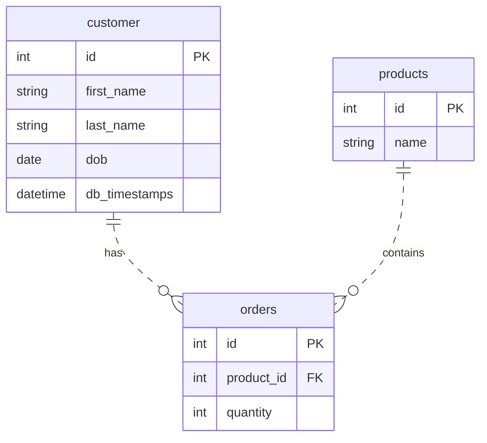
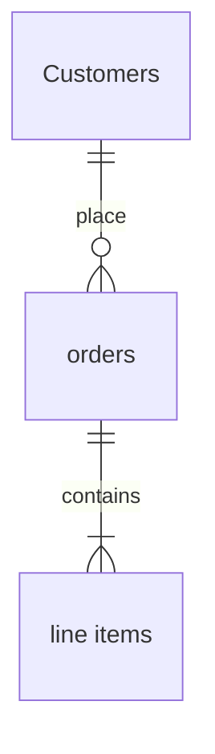

# Creating diagrams

Explore these diagrams with the zoom and source controls. To create your own, run mdxserve locally, edit a section, add an empty paragraph, and type `/mermaid`. Enable diagram conversion in Settings → Diagrams or with `mdxserve setup` first.

Describe a relationship such as “Customers place orders; each order contains line items”, or drop an exported image into the dialog. Review assumptions before inserting the result, then save the section.

