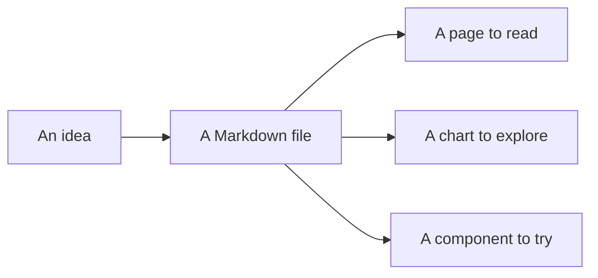

# Take it for a spin

This is a document, and it is also the demo. Switch a tab, hover over a chart, and zoom into a diagram. You can explore these examples without installing anything.

## Start with a little structure

Components are available right inside a `.md` or `.mdx` file. These tabs, callouts, and badges use mdxserve's builtins.

<Tabs>
  <Tab label="A project note">
    <Callout tone="note" title="A good place to leave some context">
      Put the decision next to the diagram. Explain the surprising number beside the chart. Keep the useful bits together.
    </Callout>
    Status: <Badge tone="ok" dot>Ready to read</Badge>
  </Tab>
  <Tab label="The MDX behind it">

```mdx
<Callout tone="note" title="A good place to leave some context">
	Put the decision next to the diagram.
</Callout>

Status: <Badge tone="ok" dot>Ready to read</Badge>
```

  </Tab>
</Tabs>

The [component collection](./examples/06-builtins.mdx) includes tooltips, buttons, cards, keyboard shortcuts, file trees, dropdowns, screenshots, and code diffs.

## Give an explanation a shape

A Mermaid code fence becomes a diagram. Use its controls to zoom, open it full-screen, or look at the source.



There are more [diagram examples](./examples/08-diagram-authoring.mdx), including entity relationships. On your own machine, the diagram editor can help turn rough text or an image into Mermaid with a configured Codex or Claude Code provider.

## Put the numbers in the document

Hover over a bar to inspect it. These are invented numbers for the demo, so please do not take them as a benchmark.

<Chart
	filename="sample-reading.json"
	type="bar"
	data={[
		{ label: "Mon", notes: 4, plans: 2 },
		{ label: "Tue", notes: 7, plans: 3 },
		{ label: "Wed", notes: 5, plans: 6 },
		{ label: "Thu", notes: 9, plans: 4 },
		{ label: "Fri", notes: 6, plans: 5 },
	]}
	series={["notes", "plans"]}
	yLabel="Documents read"
	xLabel="Sample week"
/>

The [charts page](./examples/07-charts.mdx) has line and area charts, horizontal bars, histograms, and sparklines. The [data table example](./examples/12-data-tables.mdx) lets you try typed columns, sorting, and filters.

## Show what changed

<Diff
	title="docs/hello.md"
	before={"# Project notes\n\nRead this in your editor."}
	after={"# Project notes\n\nRead this in your browser.\n\nAdd a diagram when it helps."}
/>

Code fences also support a filename, line numbers, and highlighted lines:

```ts title="a-small-idea.ts" showLineNumbers {2}
const idea = "A folder of notes";
const nextStep = "Open it in the browser";
console.log(idea, nextStep);
```

## Bring your own React

The counter on the [intro page](./README.mdx) is imported from a neighboring React file. Open the [custom component example](./examples/03-custom-components.mdx) to try it and see how the import works.

Use JSX for the interactive part and Markdown for the explanation. Both `.md` and `.mdx` go through the same pipeline, including JSX and imports.

## Explore the reader, too

Try the theme switch in the top bar. Use <Kbd>⌘</Kbd> <Kbd>K</Kbd> on macOS or <Kbd>Ctrl</Kbd> <Kbd>K</Kbd> elsewhere to search the served documents. The sidebar follows the folder structure, and the table of contents follows the page's headings.

When you [run mdxserve locally](./get-started.mdx), you can also edit document sections, save them back to disk, and see changes from your text editor appear in the browser. Export a document to a single HTML file when you want to send a copy.

[Browse every example →](./examples/README.mdx)
