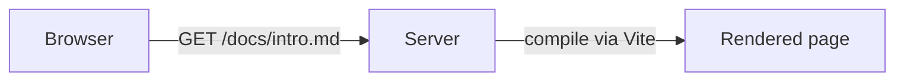
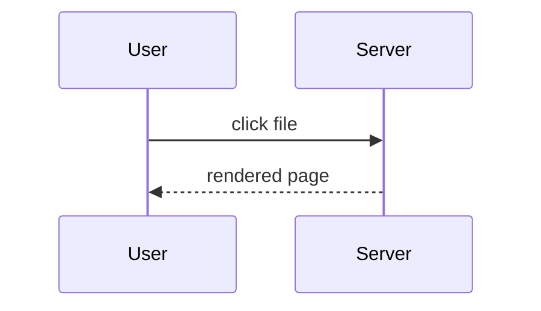

# Writing Markdown for mdxserve

mdxserve serves a folder of `.md` / `.mdx` files as a browsable site: a file listing,
rendered pages with syntax highlighting, mermaid diagrams, and a small library of builtin
components. `.md` and `.mdx` are treated identically — both go through MDX, so the builtin
components work in either.

Markdown files have many readers besides mdxserve (GitHub, editors, other tools). The goal
is the **simplest Markdown that is still visual**: reach for richer features only when they
add clarity, and prefer features that degrade gracefully everywhere else.

## The ladder — prefer lower rungs

1. **Plain GitHub-flavored Markdown.** Headings, short paragraphs, lists, task lists, tables,
   links, bold for the one thing that matters. Works everywhere. Most content should stop here.
2. **Fenced code with a language tag.** Always tag the language (`ts`, `bash`, `json`, …). Add
   fence meta when it helps the reader: `title="path/to/file.ts"`, `showLineNumbers`,
   `{3-5}` to highlight lines. mdxserve renders these richly; other tools ignore the meta.
3. **Mermaid diagrams** for flows, sequences, states, and architecture. mdxserve renders them as
   pan/zoomable diagrams (with a toggle to the source); GitHub renders them too; everywhere else
   they are still readable text. Prefer `flowchart` and `sequenceDiagram`; keep a diagram to
   roughly 15 nodes or fewer — split larger ones.
4. **Builtin components** (`<Callout>`, `<Tabs>`, `<Badge>`, `<Tooltip>`, `<Button>`, `<Diff>`, `<Card>`,
   `<Kbd>`, `<FileTree>`, `<Chart>`, `<Sparkline>`) only when they make the content clearer: a warning
   the reader must not miss, per-OS or per-language variants of the same instructions, a status label,
   a small dataset that's clearer as a shape than a table. Outside mdxserve these show as raw tags, so
   use them sparingly and never for decoration.

Don't: write raw HTML or inline styles; import or create custom components; use emoji as
icons where a `Badge` or `Callout` would do; nest components for layout; put a component in a
file the user will mainly read elsewhere (e.g. a README on GitHub) unless they asked.

MDX is stricter than Markdown: a bare `{`, `}` or an unclosed `<tag>` in prose is a compile
error, not literal text. Put such characters in backticks or escape them (`\{`).

## Quick reference

A table beats a list of "X: Y" lines:

```md
| Option   | Default | Effect                    |
| -------- | ------- | ------------------------- |
| `--port` | `4040`  | Port to listen on         |
| `--host` | `127.0.0.1` | Interface to bind (`0.0.0.0` for LAN) |
```

Code with a title, line numbers, and highlighted lines:

````md
```ts title="src/server.ts" showLineNumbers {3-4}
const server = http.createServer(handler);
server.listen(port);
// highlighted:
console.log(`http://localhost:${port}`);
```
````

A flow and a sequence:

````md

````

````md

````

Task lists for progress; keep them flat:

```md
- [x] Read the existing router
- [ ] Add the listing endpoint
- [ ] Verify in the browser
```

## Builtin components

Available in any `.md` or `.mdx` with no import. The registry — not this file — is the
authoritative list of components and props. Before using a component for the first time in a
session, check it. If the `mdxserve` MCP server is connected, use its tools instead (named
like `list_components` / `show_component` — the exact prefix depends on how the user
registered the server; `./setup.sh` registers it as `mdxserve`); the commands below are the
fallback:

```bash
npx mdxserve components search           # list every builtin with a one-line description
npx mdxserve components search tab       # search by name, description, or prop name
npx mdxserve components show Callout     # props table (types, defaults) + when to use
npx mdxserve components show Callout --json
```

Minimal usage:

```mdx
<Callout tone="warn" title="Before you deploy">
  Rotate the key first; the old one stops working immediately.
</Callout>

<Tabs>
  <Tab label="macOS">`brew install foo`</Tab>
  <Tab label="Linux">`apt install foo`</Tab>
</Tabs>

Status: <Badge tone="ok" dot>Online</Badge>

The <Tooltip content="Mean time to recovery">MTTR</Tooltip> improved.

<Button href="./setup.md">Continue to setup</Button>

<Diff before={`port: 3000`} after={`port: 4000`} />

Press <Kbd>⌘</Kbd><Kbd>K</Kbd> to open search.
```

Components contain ordinary Markdown: a `Tab` can hold lists, paragraphs, and code fences.
Leave a blank line between a component tag and a Markdown block inside it so the block is
parsed as Markdown.

## Plan files

Plans are read in mdxserve and in plain text. Use headings for phases, a task list per phase,
a table for files-to-change, and at most one mermaid diagram (the architecture or the main
flow). Skip components in plans unless the user views plans only in mdxserve.

## After writing

If the `mdxserve` MCP server is connected: after saving any `.md`/`.mdx` file, call
`validate_doc` with its absolute path — this works even when no `mdxserve serve` is running (a
path relative to a served root also works, but only when a server is running and exactly one
root contains it). Read every diagnostic. Fix every `error` (MDX compile errors, unknown
components, `render-error`) and any `unknown-prop` warning where a real prop was intended, then
re-run `validate_doc` until it returns `ok: true`. Compile errors and unknown components blank
the page or throw at render time — invisible until a human opens it — so this is not optional
when the tool is available.

`validate_doc` also renders the doc server-side and reports any throw as a `render-error` —
this is what catches a component that compiles fine but blanks the page (e.g. a stray
identifier that only breaks at render time). Check the result's `rendered` field: it's `false`
when no `mdxserve serve` is running, meaning only the static checks (compile, unknown
component/prop) ran — treat that as a weaker pass than `rendered: true`, and mention it to the
user rather than treating `ok: true` alone as a full clean bill of health. Even with
`rendered: true`, errors thrown inside a `useEffect`/`useLayoutEffect` and hydration mismatches
are never caught — those stay browser-only.

If the MCP server is not connected, tell the user the file was not validated; don't skip this
silently.

`validate_doc` with an absolute path still works even when no `mdxserve serve` is running, or
one is running but has no folders mounted. If `list_docs` or `search_docs` instead report that
no folders are served, call `list_roots` and then `add_root` with the doc's folder (an absolute
path) — or tell the user to run `mdxserve roots add <dir>`.

## Before saving

- Every code fence has a language tag; titles and highlights only where they help.
- Any diagram is a mermaid fence, small enough to read at a glance.
- No raw HTML, styles, imports, or custom components.
- Any builtin component used was checked with `components show` and genuinely clarifies.
- The file still reads well as plain text.
- `validate_doc` returned `ok: true` (when the mdxserve MCP server is connected), ideally with
  `rendered: true`.
