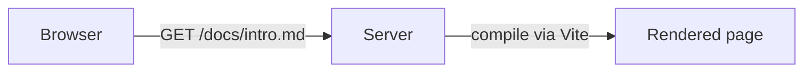
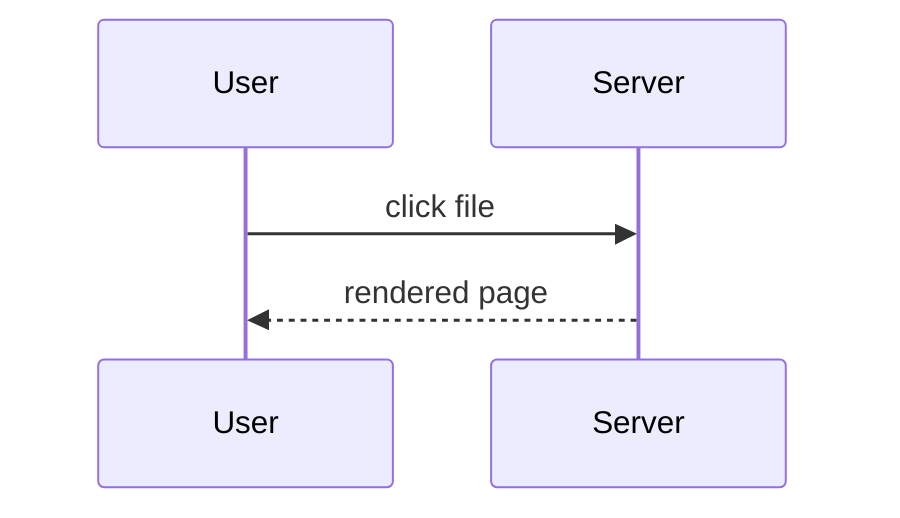

# Writing Markdown for mdxserve

mdxserve serves a folder of `.md` / `.mdx` files as a browsable site: a file listing,
rendered pages with syntax highlighting, mermaid diagrams, and a small library of builtin
components. `.md` and `.mdx` are treated identically — both go through MDX, so the builtin
components work in either.

Markdown files have many readers besides mdxserve (GitHub, editors, other tools). The goal
is the **simplest Markdown that is still visual**: reach for richer features only when they
add clarity, and prefer features that degrade gracefully everywhere else.

## The ladder — prefer lower rungs

1. **Plain GitHub-flavored Markdown.** Headings, short paragraphs, lists, task lists, tables,
   links, bold for the one thing that matters. Works everywhere. Most content should stop here.
2. **Fenced code with a language tag.** Always tag the language (`ts`, `bash`, `json`, …). Add
   fence meta when it helps the reader: `title="path/to/file.ts"`, `showLineNumbers`,
   `{3-5}` to highlight lines. mdxserve renders these richly; other tools ignore the meta.
3. **Mermaid diagrams** for flows, sequences, states, and architecture. mdxserve renders them as
   pan/zoomable diagrams (with a toggle to the source); GitHub renders them too; everywhere else
   they are still readable text. Prefer `flowchart` and `sequenceDiagram`; keep a diagram to
   roughly 15 nodes or fewer — split larger ones. Never use mermaid's `pie`, `xychart-beta`,
   `quadrantChart`, or `sankey-beta` — mdxserve doesn't render them, `mdxserve validate` reports an
   error on them, and they draw data, which is `<Chart>`'s job (or a table). Mermaid is for a
   flow or a shape, not a dataset.
4. **Builtin components** (`<Callout>`, `<Tabs>`, `<Badge>`, `<Tooltip>`, `<Button>`, `<Diff>`, `<Card>`,
   `<Kbd>`, `<FileTree>`, `<DataTable>`, `<Chart>` (bar, line, area, histogram), `<Sparkline>`, `<Screenshot>`) only when they make
   the content clearer: a warning the reader must not miss, per-OS or per-language variants of the
   same instructions, a status label, a small dataset that's clearer as a shape than a table.
   Outside mdxserve these show as raw tags, so use them sparingly and never for decoration.

Don't: write raw HTML or inline styles; import or create custom components; use emoji as
icons where a `Badge` or `Callout` would do; nest components for layout; put a component in a
file the user will mainly read elsewhere (e.g. a README on GitHub) unless they asked.

MDX is stricter than Markdown: a bare `{`, `}` or an unclosed `<tag>` in prose is a compile
error, not literal text. Put such characters in backticks or escape them (`\{`).

## Quick reference

A table beats a list of "X: Y" lines:

```md
| Option   | Default | Effect                    |
| -------- | ------- | ------------------------- |
| `--port` | `4040`  | Port to listen on         |
| `--host` | `127.0.0.1` | Interface to bind (`0.0.0.0` for LAN) |
```

Code with a title, line numbers, and highlighted lines:

````md
```ts title="src/server.ts" showLineNumbers {3-4}
const server = http.createServer(handler);
server.listen(port);
// highlighted:
console.log(`http://localhost:${port}`);
```
````

A flow and a sequence:

````md

````

````md

````

Task lists for progress; keep them flat:

```md
- [x] Read the existing router
- [ ] Add the listing endpoint
- [ ] Verify in the browser
```

## Builtin components

Available in any `.md` or `.mdx` with no import. The registry — not this file — is the
authoritative list of components and props. Before using a component for the first time in a
session, check it:

```bash
mdxserve components search           # list every builtin with a one-line description
mdxserve components search tab       # search by name, description, or prop name
mdxserve components show Callout     # props table (types, defaults) + when to use
mdxserve components show Callout --json
```

If `mdxserve` is not on your PATH, install it with `npm install -g @karimsa/mdxserve`.

Minimal usage:

```mdx
<Callout tone="warn" title="Before you deploy">
  Rotate the key first; the old one stops working immediately.
</Callout>

<Tabs>
  <Tab label="macOS">`brew install foo`</Tab>
  <Tab label="Linux">`apt install foo`</Tab>
</Tabs>

Status: <Badge tone="ok" dot>Online</Badge>

The <Tooltip content="Mean time to recovery">MTTR</Tooltip> improved.

<Button href="./setup.md">Continue to setup</Button>

<Diff before={`port: 3000`} after={`port: 4000`} />

Press <Kbd>⌘</Kbd><Kbd>K</Kbd> to open search.
```

Components contain ordinary Markdown: a `Tab` can hold lists, paragraphs, and code fences.
Leave a blank line between a component tag and a Markdown block inside it so the block is
parsed as Markdown.

## Tables: data versus facts

Use **`DataTable` for datasets**: measurements, metrics, budgets, benchmarks, and records
readers will compare, sort, or filter. Use **native Markdown tables for facts**: option
references, prose comparisons, and key/value documentation. Native tables get the same
bordered interface with conservative type detection; they do not automatically get bars.
Native tables use heading context for generated IDs. Same-header tables within the same
heading context remain interactive but do not persist preferences; use explicit `DataTable`
IDs when persistent state is required for those tables.
Both forms work identically in `.md` and `.mdx`. For documents mainly read elsewhere,
retain portable Markdown unless richer mdxserve content was requested.

Check `mdxserve components show DataTable` before first use. Supply a stable, descriptive
`id` unique within the document, and preserve it when updating data. Sorting, filters, and
unit preferences are saved locally under the document and ID. Give columns stable unique
`key` values; row objects use those keys. Missing values use `null`, never an invented zero.

```mdx
<DataTable
  id="endpoint-performance"
  caption="Endpoint performance"
  columns={[
    { key: "endpoint", label: "Endpoint", type: "text" },
    { key: "success", label: "Success", type: "percent" },
    { key: "mean", label: "Mean", type: "time", unit: "ms", group: "Latency", bars: true },
    { key: "peak", label: "Peak", type: "time", unit: "ms", group: "Latency", bars: true },
    { key: "payload", label: "Payload", type: "bytes", unit: "B" },
    { key: "cost", label: "Cost", type: "currency", format: (value) => `$${value.toFixed(2)}` }
  ]}
  data={[
    { endpoint: "/search", success: 0.995, mean: 120, peak: 450, payload: 2048, cost: 12.50 },
    { endpoint: "/export", success: 0.98, mean: 2400, peak: 8000, payload: 1048576, cost: 25 }
  ]}
/>
```

- `text` uses strings; readers filter with a regular expression, case-insensitive.
- `number` uses finite numbers; readers filter by inclusive minimum and maximum.
- `percent` uses **fractions**: `0.15` displays **15%**. Filter inputs use displayed percentage
  points (`15` or `15%`), not fractions.
- `time` uses numeric data and a required base `unit` accepted by `ms` (e.g. `ms`, `seconds`,
  `hours`). One unit is chosen for the entire column; readers can override it. Filters accept
  durations such as `500ms` or `2s`; bare numbers use the currently displayed unit.
- `bytes` uses numeric data and a required base `unit` accepted by `bytes` (`B`, `KB`, `MB`,
  `GB`, `TB`, `PB`). Units are binary (1 KB = 1024 B). The whole column shares a display unit;
  filters accept `10MB`, or bare numbers in the displayed unit.
- `currency` keeps numeric data and **requires `format: (value) => string`**. Include the
  intended currency in that formatter or label. Filters expand `10K`, `2M`, `1B`, and `1T`.
- Adjacent columns with the same `group` get a shared top-level heading.
- Optional `align: "left" | "center" | "right"` overrides type-based alignment. Native Markdown tables preserve explicit GFM delimiter alignment.
- Set `bars: true` only when comparing magnitudes is meaningful. Omit it for IDs, years,
  ranks, or ambiguous measurements. Each column has its own zero-inclusive scale, fixed
  across sorting/filtering; negative values extend left of zero. Equal bar lengths across
  different columns do not imply equal quantities.

## Plan files

Plans are read in mdxserve and in plain text. Use headings for phases, a task list per phase,
a table for files-to-change, and at most one mermaid diagram (the architecture or the main
flow, never a chart). Skip components in plans unless the user views plans only in mdxserve.

## After writing

After saving any `.md`/`.mdx` file, run `mdxserve validate <absolute path>`. It works even when
no `mdxserve serve` is running. Read the first line and every diagnostic under it: it is
`OK: <path>`, `OK with N warnings: <path>`, or a list of problems. Fix every `error` (MDX
compile errors, unknown components, `render-error`) and any `unknown-prop` warning where a real
prop was intended, then re-run until the first line is `OK` with only intended warnings. The
exit code is 1 when any error was reported. Compile errors and unknown components blank the
page or throw at render time — invisible until a human opens it — so this is not optional.

`validate` also renders the doc server-side and reports any throw as a `render-error` — this is
what catches a component that compiles fine but blanks the page (e.g. a stray identifier that
only breaks at render time). Read the line after the diagnostics: `Rendered OK`, or
`Not rendered (…)` when no `mdxserve serve` is reachable, meaning only the static checks
(compile, unknown component/prop) ran. Treat that as a weaker pass and mention it to the user
rather than treating `OK` alone as a full clean bill of health. Even with `Rendered OK`, errors
thrown inside a `useEffect`/`useLayoutEffect` and hydration mismatches are never caught — those
stay browser-only. `hint:` lines are advisory and never affect the result. When scripting, use
`--json` and check the `rendered` field.

If `validate` says the file is outside every served directory, or `mdxserve search` /
`mdxserve docs` report that no folders are served, run `mdxserve roots list`, then
`mdxserve roots add <absolute dir>` with the doc's folder.

If `mdxserve` is not installed, tell the user the file was not validated; don't skip this
silently.

## Before saving

- Every code fence has a language tag; titles and highlights only where they help.
- Any diagram is a mermaid fence, small enough to read at a glance, and none of them draws a
  chart (no `pie`, `xychart-beta`, `quadrantChart`, `sankey-beta` — use `<Chart>` or a table).
- No raw HTML, styles, imports, or custom components.
- Any builtin component used was checked with `components show` and genuinely clarifies.
- The file still reads well as plain text.
- `mdxserve validate` printed `OK`, ideally `Rendered OK`.
